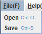

# P1 miniCAD

## 1 实验要求

用Java的awt和swing做一个简单的绘图工具，以CAD的方式操作，能放置直线、矩形、圆和文字，能选中图形，修改参数，如颜色等，能拖动图形和调整大小，可以保存和恢复。

## 2 实验环境

操作系统：Windows 10(64 bits)

CPU：Intel(R) Core(TM) i7-1065G7 CPU @ 1.30GHz   1.50 GHz

Java版本：

java 18.0.2 2022-07-19
Java(TM) SE Runtime Environment (build 18.0.2+9-61)
Java HotSpot(TM) 64-Bit Server VM (build 18.0.2+9-61, mixed mode, sharing)

IDE: VSCode

编译及运行：推荐使用VSCode，在VSCode中下载 `Extension Pack for Java` 拓展，此拓展会自动识别Java工程，识别完成后点击导出到Jar文件即可产生可执行的jar文件。在命令行中输入 `./miniCAD.jar` 便可运行。

## 3 功能介绍

#### 主界面

​	



如图，顶部为菜单栏，包含文件和帮助两个菜单，文件菜单中包含打开和保存两个菜单项，帮助菜单中包含教程菜单项。说明如下：

- Open：点击后弹出文件选择器，可以选择目录并打开其中的.mcad文件。
- Save：点击后弹出文件选择器，可以选择目录并将当前文件保存为.mcad格式。
- Tutorial：点击后会出现教程弹窗，主要是对按键及其作用的说明。

右边空白部分为画板，用于绘制图形。

侧边为工具栏，说明如下：

- Select：选中，可以选中已绘制的图形。选中后可以拖动图形，在特定点拖动可以改变图形的形状和大小。

- Line：绘制直线。鼠标按下的点为直线的第一个端点，鼠标松开的点为第二个端点。

- Rectangle：绘制矩形。鼠标按下和松开的点作为两个对角端点。
- Circle：绘制椭圆。鼠标按下和松开的点作为两个对角端点。
- Text：绘制文本。按下后弹出输入框，设置要绘制的文本内容，设置完成后便可以在画板上绘制。

- Color Panel：颜色面板，设置画笔颜色，可以选择预置的五种颜色，也可以点击More选择更多颜色。若设置颜色时选中了某图形，则该图像的颜色也会变化。

#### 教程弹窗

​	

对各按键及其功能说明如下：

- Right btn：单击鼠标右键，可以快速切换成Select模式。
- Double left btn：在Select模式下用鼠标左键双击已绘制的文本，可以修改文本内容。
- Mouse wheel：可以通过鼠标滚轮设置画笔的粗细，向上滚变粗，向下滚变细，设置了最小和最大粗细度。
- Backspace：选中图形后按一下回退键，可以删除该图形。
- -/=：选中图形后按-键可以使图形变细，按=键可以使其变粗，设置了最小和最大粗细度。

- T：选中图形后按T键可以将其移至最高图层，即当鼠标处于多个图形内部时会优先选中此图形。
- Ctrl+C：选中图形后按Ctrl+C，会拷贝此图形至粘贴板
- Ctrl+V：按Ctrl+V，会以鼠标当前位置为左上顶点粘贴被克隆的图形。

- Ctrl+L：按Ctrl+L，会删除所有图形，即清屏。

## 4 设计与实现

### MVC框架

本项目采用MVC(Model-View-Control)框架。

##### Model

Model负责所有图形的管理和存储，主要是使用 `ArrayList<Shape>` 来存储各个图形，而各种Shape的定义也属于Model部分。当在画布上增删改图形时，Control会对Model中的数据进行相应修改。同时Model还为View提供用于图形绘制的数据。

##### View

View负责图形的绘制，在本实验中View特指画布，因为只有画布中的内容需要刷新。View本身做的事情很简单，就是遍历Model提供的图形列表，分别调用其render函数，从而绘制出各个图形。View对外只提供refresh接口：

```java
void refresh() {
    repaint();
}
```

在Control修改Model中的数据后，refresh就会被调用，从而简单地重新绘制所有图形。

##### Control

Control负责各种事件的监听，并做相应的处理。当有事件增删改图形时，Control就修改Model的数据，View紧接着刷新整个画布。

### 界面设计

界面整体为Window模块，Window中包含了菜单栏、工具栏和画布。

#### Window

继承了JFrame，主要就是设置了标题、图标和各个部分的布局。构造时为画布(View)添加了一系列事件监听器。

#### Menubar

菜单栏，设置了文件和帮助菜单，并设置了Open、Save、Tutorial等菜单项。构造时为各个菜单项添加了事件监听器。

#### Sidebar

工具栏，设置了各个按钮，并以特定布局摆放。构造时为各个按钮添加了事件监听器。

### 图形设计

#### Shape

定义了各种图形及其操作。各种图形均以抽象类Shape为父类，有利于之后利用动态绑定统一函数调用接口，减少代码冗余。Shape类实现了 `Serializable` 和 `Cloneable` 两个接口，主要用于文件的保存和恢复。各种图形公共的参数和操作均定义在Shape类中，然后各种图形分别覆写成自己的版本。其中 render 函数负责图形的绘制，contain 函数用于判断鼠标与图形之间的位置关系，clone 函数用于构造图形的克隆体。其余均为get/set函数和辅助函数。

#### AddShape

用于绘制新图形时向Model的列表中添加该图形，为了统一调用接口，所以具有公共父类AddShape，各种图形分别覆写addShape为自己的版本。

### 事件监听处理

#### Control

本项目中所有部件的事件监听器均在Control中实现，同时定义了许多跟绘图相关的变量，如当前绘图模式、当前被选中的图形、当前画笔的颜色、当前鼠标的位置等。

点击工具栏按钮时，主要就是切换当前的绘图模式或者修改当前画笔的颜色。

鼠标操作时会根据事件类型分别处理：如果是单击左键，则根据绘图模式决定是绘制新图形还是选中已有图形；如果单击右键则切换至选择模式；如果双击左键且鼠标选中了文本图形，则可以修改文本内容；如果滚动滑轮，则修改画笔的粗细；拖曳时，如果处于选择模式则移动选中的图形，如果选中了特定点，则改变其形状和大小，如果处于绘图模式，则说明还在决定图形的第二个端点，将第二个端点的参数改成鼠标当前位置即可；鼠标释放时可能是结束了绘制，将当前绘制图形置null即可。

键盘操作根据按键分别处理，较为简单，可见源码。

对于文件操作，主要就是打开一个文件选择器让用户选择目录与文件，为了匹配此应用，文件的后缀名均默认为.mcad。保存文件和读取文件，主要是利用 `ObjectInputStream` 和 `ObjectOutputStream` 实现的，由于所有图形都声明实现了可串行化接口，所以可以使用 `readObject()` 和 `writeObject()`，实现对象的串行化和反串行化。

## 5 测试结果

#### 图形绘制

绘制直线、矩形、圆

​	

绘制文本

​	

​	

#### 修改参数

能选中图形，修改参数(颜色，粗细度，大小)，能拖动图形

​	

如图，修改了眉毛的长度，眼睛的颜色，嘴巴的大小和粗细度，并调整了嘴巴和文本的位置

选中各图形时会显示特定端点，拖动特定端点可以调整图形的形状和大小，选中时显示如下：

​		

修改文本内容

​	

​	

#### 删除图形

​	

选中嘴巴后按Backspace，嘴巴被删除。

#### 保存文件

​	

点击Save或使用Ctrl+S快捷键

​	

保存为sample.mcad

#### 打开(恢复文件)

在打开前先做一些修改，如下：

​	

打开之前保存的文件：

​	

​	

如图，咸蛋超人又回来了，可以修改原有图形和增加新图形：

​	

#### 其他功能

功能介绍中的功能均已实现，如复制粘贴和清屏等，此处不做展示了，可以使用一下，或者见[可能存在的演示视频](https://space.bilibili.com/258868918)。

## 6 TODO

想到的一些功能，暂时还没有实现，其中一些功能的实现其实比较简单：

1. 添加数据面板，在选中图形后显示其当前的thickness等参数，且可以直接通过输入数据来定量修改参数
2. 鼠标悬浮在图形边界时突出显示
3. 通过按键使图形保持标准的圆和正方形
4. 选中图形边框上任意位置都能调整大小，其中选择四个顶点时可以按任意方法伸缩，选中四条边时只能按水平/垂直方法伸缩
5. 图层设置，例如将新加的和最近操作过的图形移至最高层(很容易)，但是要考虑性能开销。
6. Redo和Undo
7. 添加状态栏进行相关信息的展示，如当前处于什么模式，鼠标的位置，图形的信息等
8. 导出为图片
9. 美化界面，将文字描述改为背景色或icon(美工就暂时不做了)
10. 让用户选择字体及大小
11. 将已有文件中的图形加载到当前的文件中
12.  一次性选中多个图形

## 7 讨论与心得

通过本次实验复习了MVC设计框架，也接触了Java awt和swing的很多接口，感叹于Java丰富又便捷的库函数。本次实验尝试了软件设计流程，实现了很多轮功能迭代，锻炼了软件设计的能力。其实一开始写好基本的功能后，后面只需要稍作添加和修改就可以实现很多新功能，还是很有意思的。总的来说，实践是最好的老师，通过编写程序，我对事件响应、图形绘制、序列化、克隆、动态绑定等都有了更好的掌握，对Java GUI的设计有了更深的理解。同时留下了很多TODO，也许有空会实现一下吧。


